# AI Guard DAO - Backend Architecture

> **Principal Backend Architect Documentation**  
> Version: 2.0.0 | Last Updated: January 2026  
> Node.js Microservices • Python AI Integration • Web3 Security

---

## Table of Contents

1. [Executive Summary](#executive-summary)
2. [Recommended Tech Stack (2026)](#recommended-tech-stack-2026)
3. [Directory Structure](#directory-structure)
4. [System Architecture](#system-architecture)
5. [API Specification](#api-specification)
6. [Security & Performance](#security--performance)
7. [Deployment & Operations](#deployment--operations)

---

## Executive Summary

AI Guard DAO is a **multi-layered security orchestration system** protecting decentralized governance from social engineering, manipulation, and malicious proposals. The backend consists of two primary services:

| Service | Role | Technology |
|---------|------|------------|
| **API Gateway (Orchestrator)** | Auth, rate limiting, request routing | NestJS / Node.js |
| **Intelligence Engine** | AI inference, risk analysis | FastAPI / Python |

**Key Principles:**
- ✅ Provider-agnostic LLM abstraction (Groq, TEE, Local)
- ✅ Strict schema validation at every boundary (Zod + Pydantic)
- ✅ Async-first with job queues for heavy inference
- ✅ Safe fallback states on any failure
- ✅ SIWE (Sign-In With Ethereum) authentication

---

## Recommended Tech Stack (2026)

### Service A: API Gateway (Orchestrator)

| Category | Technology | Rationale |
|----------|------------|-----------|
| **Runtime** | Node.js 22 LTS | V8 performance, native TypeScript support |
| **Framework** | NestJS 11 | Modular architecture, built-in DI, guards, interceptors |
| **Validation** | Zod 4 | Runtime type safety, TypeScript inference |
| **Auth** | `siwe` + `ethers.js` | SIWE standard for Web3 authentication |
| **Queue** | BullMQ 5 | Redis-backed, typed job definitions, retries |
| **Cache** | Redis 7 + `ioredis` | Proposal deduplication, rate limiting |
| **HTTP Client** | `undici` | Native Node.js, connection pooling |
| **Logging** | Pino | JSON structured logging, low overhead |
| **Tracing** | OpenTelemetry | Distributed tracing across services |

### Service B: Intelligence Engine (Python)

| Category | Technology | Rationale |
|----------|------------|-----------|
| **Runtime** | Python 3.12 | Pattern matching, performance improvements |
| **Framework** | FastAPI 0.115 | Async-native, automatic OpenAPI, Pydantic v2 |
| **Validation** | Pydantic 2 | High-performance validation, JSON Schema |
| **LLM Orchestration** | LangChain 0.3 / LlamaIndex | RAG pipelines, agent chaining |
| **LLM Provider** | Groq API (Llama 4 Scout) | Ultra-low latency inference |
| **Vector Store** | pgvector / Qdrant | Proposal similarity search, RAG context |
| **Background Tasks** | Celery 5 + Redis | Long-running inference jobs |
| **Logging** | Loguru | Structured logging with rotation |

### Shared Infrastructure

| Category | Technology | Rationale |
|----------|------------|-----------|
| **Message Broker** | Redis 7 | BullMQ + Celery compatibility |
| **Database** | PostgreSQL 16 | JSONB for flexible schemas, pgvector |
| **Container Runtime** | Docker + Podman | Reproducible builds, security |
| **Orchestration** | Kubernetes / Docker Compose | Horizontal scaling |
| **Secrets** | HashiCorp Vault / AWS Secrets Manager | Secure credential storage |
| **API Gateway** | Kong / Traefik | Rate limiting, TLS termination |

---

## Directory Structure

```
ai-guard-dao-backend/
├── docker-compose.yml              # Local development orchestration
├── docker-compose.prod.yml         # Production configuration
├── turbo.json                      # Turborepo configuration
├── package.json                    # Root workspace package.json
├── pnpm-workspace.yaml             # PNPM workspace config
│
├── apps/
│   │
│   ├── api-gateway/                # ═══ SERVICE A: NestJS Orchestrator ═══
│   │   ├── Dockerfile
│   │   ├── package.json
│   │   ├── tsconfig.json
│   │   ├── nest-cli.json
│   │   │
│   │   ├── src/
│   │   │   ├── main.ts                          # Application bootstrap
│   │   │   ├── app.module.ts                    # Root module
│   │   │   │
│   │   │   ├── config/
│   │   │   │   ├── app.config.ts                # Typed configuration
│   │   │   │   ├── redis.config.ts              # Redis connection config
│   │   │   │   └── llm.config.ts                # LLM provider settings
│   │   │   │
│   │   │   ├── guards/
│   │   │   │   ├── wallet-auth.guard.ts         # ⭐ SIWE verification middleware
│   │   │   │   ├── rate-limit.guard.ts          # Redis-backed rate limiting
│   │   │   │   └── token-gate.guard.ts          # Token balance verification
│   │   │   │
│   │   │   ├── interceptors/
│   │   │   │   ├── logging.interceptor.ts       # Request/response logging
│   │   │   │   ├── cache.interceptor.ts         # Response caching
│   │   │   │   └── timeout.interceptor.ts       # Request timeout handling
│   │   │   │
│   │   │   ├── modules/
│   │   │   │   │
│   │   │   │   ├── auth/
│   │   │   │   │   ├── auth.module.ts
│   │   │   │   │   ├── auth.controller.ts       # /auth/nonce, /auth/verify
│   │   │   │   │   ├── auth.service.ts          # SIWE session management
│   │   │   │   │   └── dto/
│   │   │   │   │       ├── nonce-request.dto.ts
│   │   │   │   │       └── verify-request.dto.ts
│   │   │   │   │
│   │   │   │   ├── scan/
│   │   │   │   │   ├── scan.module.ts
│   │   │   │   │   ├── scan.controller.ts       # POST /api/v1/scan
│   │   │   │   │   ├── scan.service.ts          # Orchestrates analysis flow
│   │   │   │   │   └── dto/
│   │   │   │   │       ├── scan-request.dto.ts
│   │   │   │   │       └── scan-response.dto.ts
│   │   │   │   │
│   │   │   │   ├── proposals/
│   │   │   │   │   ├── proposals.module.ts
│   │   │   │   │   ├── proposals.controller.ts  # CRUD for proposals
│   │   │   │   │   └── proposals.service.ts
│   │   │   │   │
│   │   │   │   └── webhooks/
│   │   │   │       ├── webhooks.module.ts
│   │   │   │       └── webhooks.controller.ts   # Receives Python results
│   │   │   │
│   │   │   ├── services/
│   │   │   │   ├── scout-integration.service.ts # ⭐ Bridge to Python Intelligence
│   │   │   │   ├── redis.service.ts             # Redis operations
│   │   │   │   ├── queue.service.ts             # BullMQ job management
│   │   │   │   └── blockchain.service.ts        # On-chain interactions
│   │   │   │
│   │   │   ├── jobs/
│   │   │   │   ├── analysis.processor.ts        # BullMQ job processor
│   │   │   │   └── analysis.queue.ts            # Queue definitions
│   │   │   │
│   │   │   ├── schemas/
│   │   │   │   ├── risk.schema.ts               # Zod schemas for risk data
│   │   │   │   └── proposal.schema.ts           # Proposal validation
│   │   │   │
│   │   │   └── utils/
│   │   │       ├── hash.util.ts                 # Proposal hashing for cache
│   │   │       └── retry.util.ts                # Exponential backoff
│   │   │
│   │   └── test/
│   │       ├── auth.e2e-spec.ts
│   │       └── scan.e2e-spec.ts
│   │
│   │
│   └── ai-engine/                  # ═══ SERVICE B: FastAPI Intelligence ═══
│       ├── Dockerfile
│       ├── pyproject.toml          # Poetry/uv dependency management
│       ├── requirements.txt        # Pinned dependencies
│       │
│       ├── app/
│       │   ├── main.py                          # FastAPI application
│       │   ├── config.py                        # Settings via pydantic-settings
│       │   │
│       │   ├── api/
│       │   │   ├── __init__.py
│       │   │   ├── routes.py                    # Route definitions
│       │   │   ├── deps.py                      # Dependency injection
│       │   │   └── v1/
│       │   │       ├── __init__.py
│       │   │       ├── analyze.py               # POST /analyze endpoint
│       │   │       ├── simulate.py              # POST /simulate endpoint
│       │   │       └── health.py                # GET /health
│       │   │
│       │   ├── agents/
│       │   │   ├── __init__.py
│       │   │   ├── base_agent.py                # Abstract agent interface
│       │   │   ├── reputation_agent.py          # Agent 1: Wallet scoring
│       │   │   ├── nlp_agent.py                 # Agent 2: Content analysis
│       │   │   └── mediator_agent.py            # Agent 3: Ensemble classifier
│       │   │
│       │   ├── prompts/
│       │   │   ├── __init__.py
│       │   │   ├── risk-analysis.template       # ⭐ System prompt for Llama 4
│       │   │   ├── reputation.template          # Wallet analysis prompt
│       │   │   ├── nlp-analysis.template        # Content safety prompt
│       │   │   └── mediator.template            # Ensemble decision prompt
│       │   │
│       │   ├── services/
│       │   │   ├── __init__.py
│       │   │   ├── llm_service.py               # LLM provider abstraction
│       │   │   ├── snapshot_service.py          # Proposal summarization
│       │   │   ├── vector_service.py            # RAG / similarity search
│       │   │   └── blockchain_service.py        # Web3.py for on-chain data
│       │   │
│       │   ├── schemas/
│       │   │   ├── __init__.py
│       │   │   ├── requests.py                  # Pydantic request models
│       │   │   ├── responses.py                 # Pydantic response models
│       │   │   └── internal.py                  # Internal data models
│       │   │
│       │   ├── workers/
│       │   │   ├── __init__.py
│       │   │   └── celery_worker.py             # Celery task definitions
│       │   │
│       │   └── utils/
│       │       ├── __init__.py
│       │       ├── text_processing.py           # Text normalization
│       │       └── scoring.py                   # Risk score calculations
│       │
│       └── tests/
│           ├── conftest.py
│           ├── test_agents.py
│           └── test_api.py
│
│
├── packages/                       # ═══ SHARED LIBRARIES ═══
│   │
│   ├── shared-types/               # TypeScript type definitions
│   │   ├── package.json
│   │   └── src/
│   │       ├── risk.types.ts
│   │       └── proposal.types.ts
│   │
│   └── contracts-sdk/              # Generated contract bindings
│       ├── package.json
│       └── src/
│           ├── abis/
│           └── index.ts
│
│
├── infrastructure/                 # ═══ DEPLOYMENT CONFIG ═══
│   ├── k8s/
│   │   ├── api-gateway.yaml
│   │   ├── ai-engine.yaml
│   │   └── redis.yaml
│   │
│   └── terraform/
│       ├── main.tf
│       └── variables.tf
│
│
└── scripts/                        # ═══ DEVELOPMENT SCRIPTS ═══
    ├── dev.sh                      # Start all services
    ├── seed-db.ts                  # Database seeding
    └── test-flow.ts                # End-to-end test script
```

---

## System Architecture

### High-Level Overview


### Sequence Diagram: Proposal Analysis Flow

```mermaid
sequenceDiagram
    autonumber
    participant FE as Frontend (Next.js)
    participant GW as API Gateway (NestJS)
    participant AUTH as Wallet Auth Guard
    participant CACHE as Redis Cache
    participant Q as BullMQ Queue
    participant PY as Python Worker (FastAPI)
    participant LLM as Llama 4 Scout (Groq)
    participant WH as Webhook Handler
    
    Note over FE,WH: 🔐 Authentication Phase
    FE->>GW: POST /auth/nonce {address}
    GW->>CACHE: Store nonce (TTL: 5min)
    GW-->>FE: {nonce}
    FE->>FE: Sign message with wallet
    FE->>GW: POST /auth/verify {message, signature}
    GW->>AUTH: Verify SIWE signature
    AUTH->>CACHE: Create session
    AUTH-->>FE: {sessionToken, expiresAt}
    
    Note over FE,WH: 📊 Analysis Request Phase
    FE->>GW: POST /api/v1/scan {proposal, sessionToken}
    GW->>AUTH: Validate session & token balance
    AUTH->>CACHE: Check token gate (balance ≥ 100 GUARD)
    
    alt Token Gate Failed
        AUTH-->>FE: 403 Insufficient Token Balance
    end
    
    GW->>CACHE: Check proposal hash cache
    
    alt Cache Hit
        CACHE-->>GW: Cached analysis result
        GW-->>FE: {cached: true, result}
    end
    
    Note over FE,WH: ⚡ Queue & Process Phase
    GW->>Q: Enqueue analysis job
    Q-->>GW: {jobId}
    GW-->>FE: {jobId, status: "queued"}
    
    Q->>PY: Consume job from queue
    
    par Agent 1: Reputation Sentinel
        PY->>PY: Analyze wallet history (deterministic)
    and Agent 2: NLP Analyst
        PY->>LLM: POST /chat/completions {proposal_text}
        LLM-->>PY: {risk_score, red_flags, reasoning}
    end
    
    PY->>PY: Agent 3: Mediator ensemble
    PY->>CACHE: Store result (TTL: 1hr)
    
    Note over FE,WH: 📬 Response Delivery Phase
    PY->>WH: POST /webhooks/analysis-complete {jobId, result}
    WH->>GW: Notify completion
    
    alt Polling Mode
        FE->>GW: GET /api/v1/scan/{jobId}/status
        GW->>CACHE: Get job result
        GW-->>FE: {status: "complete", result}
    else WebSocket Mode
        GW-->>FE: WS: {event: "analysis_complete", result}
    end
```



### Agent Pipeline Architecture

```mermaid
flowchart LR
    subgraph Input
        PROP[Proposal Data]
        WALLET[Wallet Address]
    end
    
    subgraph Agent1["🛡️ Agent 1: Reputation Sentinel"]
        A1IN[Wallet Input]
        A1SCORE[Deterministic Scoring]
        A1OUT[Reputation Score: 0-100]
    end
    
    subgraph Agent2["📝 Agent 2: NLP Analyst"]
        A2IN[Text Input]
        A2LLM[Llama 4 Scout]
        A2OUT[Safety Score + Red Flags]
    end
    
    subgraph Agent3["⚖️ Agent 3: Mediator"]
        A3IN[Combined Scores]
        A3ENS[Ensemble Classifier]
        A3OUT[Final Risk Score]
    end
    
    subgraph Output
        RESULT[AnalyzeResponse]
    end
    
    PROP --> A2IN
    WALLET --> A1IN
    A1IN --> A1SCORE --> A1OUT
    A2IN --> A2LLM --> A2OUT
    A1OUT --> A3IN
    A2OUT --> A3IN
    A3IN --> A3ENS --> A3OUT --> RESULT
```



---

## API Specification

### Authentication Endpoints

#### `POST /auth/nonce`

Request a nonce for SIWE authentication.

```json
// Request
{
  "address": "0x742d35Cc6634C0532925a3b844Bc9e7595f0bEb"
}

// Response (200 OK)
{
  "nonce": "8a3f2b1c9d4e5f6a",
  "issuedAt": "2026-01-25T10:30:00.000Z",
  "expiresAt": "2026-01-25T10:35:00.000Z"
}
```

#### `POST /auth/verify`

Verify SIWE signature and create session.

```json
// Request
{
  "message": "ai-guard-dao.xyz wants you to sign in with your Ethereum account:\n0x742d35Cc6634C0532925a3b844Bc9e7595f0bEb\n\nSign in to AI Guard DAO\n\nURI: https://ai-guard-dao.xyz\nVersion: 1\nChain ID: 1\nNonce: 8a3f2b1c9d4e5f6a\nIssued At: 2026-01-25T10:30:00.000Z",
  "signature": "0x..."
}

// Response (200 OK)
{
  "sessionToken": "eyJhbGciOiJIUzI1NiIsInR5cCI6IkpXVCJ9...",
  "address": "0x742d35Cc6634C0532925a3b844Bc9e7595f0bEb",
  "expiresAt": "2026-01-26T10:30:00.000Z"
}
```

---

### Scan Endpoint

#### `POST /api/v1/scan`

Submit a proposal for AI risk analysis.

**Request Schema (Zod)**

```typescript
import { z } from 'zod';

export const ScanRequestSchema = z.object({
  // Proposal identification
  proposalId: z.string().min(1).max(100).describe('Unique proposal identifier'),
  
  // Proposal content
  title: z.string().min(1).max(500).describe('Proposal title'),
  description: z.string().min(10).max(50000).describe('Full proposal description'),
  
  // Proposer information
  proposer: z.object({
    address: z.string().regex(/^0x[a-fA-F0-9]{40}$/).describe('Proposer wallet address'),
    ensName: z.string().optional().describe('ENS name if available'),
  }),
  
  // Financial details
  financials: z.object({
    requestedAmount: z.number().nonnegative().describe('Requested amount in wei'),
    tokenSymbol: z.string().default('ETH').describe('Token symbol'),
    recipientAddress: z.string().regex(/^0x[a-fA-F0-9]{40}$/).describe('Funds recipient'),
  }).optional(),
  
  // Metadata
  metadata: z.object({
    daoName: z.string().describe('DAO name'),
    chainId: z.number().int().positive().describe('Chain ID'),
    votingDeadline: z.string().datetime().optional().describe('Voting deadline ISO timestamp'),
    snapshotBlock: z.number().int().optional().describe('Snapshot block number'),
  }),
  
  // Options
  options: z.object({
    priority: z.enum(['low', 'normal', 'high']).default('normal'),
    webhook: z.string().url().optional().describe('Webhook URL for async results'),
  }).optional(),
});

export type ScanRequest = z.infer<typeof ScanRequestSchema>;
```

**Request Example**

```json
{
  "proposalId": "PROP-2026-0042",
  "title": "Treasury Diversification into stETH",
  "description": "## Summary\n\nThis proposal seeks to diversify 30% of the DAO treasury into Lido stETH...",
  "proposer": {
    "address": "0x742d35Cc6634C0532925a3b844Bc9e7595f0bEb",
    "ensName": "alice.eth"
  },
  "financials": {
    "requestedAmount": "500000000000000000000",
    "tokenSymbol": "ETH",
    "recipientAddress": "0x3cd751e6b0078be393132286c442345e5dc49699"
  },
  "metadata": {
    "daoName": "ExampleDAO",
    "chainId": 1,
    "votingDeadline": "2026-02-01T00:00:00.000Z",
    "snapshotBlock": 19500000
  },
  "options": {
    "priority": "high"
  }
}
```

**Response Schema (Zod)**

```typescript
export const ScanResponseSchema = z.object({
  // Job tracking
  jobId: z.string().uuid().describe('Unique job identifier'),
  status: z.enum(['queued', 'processing', 'complete', 'failed']),
  
  // Timing
  queuedAt: z.string().datetime(),
  completedAt: z.string().datetime().optional(),
  processingTimeMs: z.number().int().optional(),
  
  // Results (present when status === 'complete')
  result: z.object({
    // Composite scores
    compositeRiskScore: z.number().int().min(0).max(100),
    riskLevel: z.enum(['LOW', 'MEDIUM', 'HIGH', 'CRITICAL']),
    recommendation: z.enum(['APPROVE', 'REVIEW', 'REJECT']),
    
    // Individual agent scores
    agents: z.object({
      reputationSentinel: z.object({
        score: z.number().int().min(0).max(100),
        reasoning: z.string(),
        walletAge: z.number().int().describe('Days since first transaction'),
        transactionCount: z.number().int(),
        flags: z.array(z.string()),
      }),
      nlpAnalyst: z.object({
        score: z.number().int().min(0).max(100),
        reasoning: z.string(),
        redFlags: z.array(z.string()),
        manipulationTactics: z.array(z.string()),
        confidence: z.number().min(0).max(1),
      }),
      mediator: z.object({
        score: z.number().int().min(0).max(100),
        reasoning: z.string(),
        confidence: z.number().min(0).max(1),
      }),
    }),
    
    // Proposal snapshot
    snapshot: z.object({
      executiveSummary: z.string(),
      deliverables: z.array(z.string()),
      timeline: z.string(),
      budgetBreakdown: z.record(z.string(), z.number()),
    }),
    
    // Caching info
    cached: z.boolean(),
    cacheKey: z.string().optional(),
  }).optional(),
  
  // Error (present when status === 'failed')
  error: z.object({
    code: z.string(),
    message: z.string(),
  }).optional(),
});

export type ScanResponse = z.infer<typeof ScanResponseSchema>;
```

**Response Example (Complete)**

```json
{
  "jobId": "a1b2c3d4-e5f6-7890-abcd-ef1234567890",
  "status": "complete",
  "queuedAt": "2026-01-25T10:30:00.000Z",
  "completedAt": "2026-01-25T10:30:03.250Z",
  "processingTimeMs": 3250,
  "result": {
    "compositeRiskScore": 25,
    "riskLevel": "LOW",
    "recommendation": "APPROVE",
    "agents": {
      "reputationSentinel": {
        "score": 85,
        "reasoning": "Established wallet with 2+ years of activity, consistent governance participation",
        "walletAge": 847,
        "transactionCount": 1523,
        "flags": []
      },
      "nlpAnalyst": {
        "score": 78,
        "reasoning": "Clear proposal structure with detailed budget breakdown and reasonable timeline",
        "redFlags": [],
        "manipulationTactics": [],
        "confidence": 0.92
      },
      "mediator": {
        "score": 25,
        "reasoning": "Both agents indicate low risk. Recommend approval with standard oversight.",
        "confidence": 0.89
      }
    },
    "snapshot": {
      "executiveSummary": "Proposal to diversify 30% of treasury into stETH for yield generation",
      "deliverables": ["Treasury rebalancing", "Monthly yield reports"],
      "timeline": "Immediate execution with quarterly reviews",
      "budgetBreakdown": {
        "stETH_allocation": 500
      }
    },
    "cached": false
  }
}
```

---

### Internal Communication: Node.js ↔ Python

The API Gateway communicates with the Intelligence Engine via **HTTP REST** (simpler) or **gRPC** (higher performance).

#### HTTP REST Interface

**POST `http://ai-engine:8000/internal/analyze`**

```python
# Pydantic Schema (Python side)
from pydantic import BaseModel, Field
from typing import List, Dict, Any, Optional

class InternalAnalyzeRequest(BaseModel):
    """Internal request from Node.js to Python"""
    job_id: str = Field(..., description="Job ID from BullMQ")
    proposal_id: str
    proposal_text: str
    wallet_address: str
    metadata: Dict[str, Any] = Field(default_factory=dict)
    priority: str = Field(default="normal")
    callback_url: str = Field(..., description="Webhook URL for results")

class AgentResult(BaseModel):
    """Individual agent result"""
    agent_name: str
    score: int = Field(ge=0, le=100)
    reasoning: str
    flags: List[str] = Field(default_factory=list)
    confidence: float = Field(ge=0, le=1)
    metadata: Dict[str, Any] = Field(default_factory=dict)

class InternalAnalyzeResponse(BaseModel):
    """Internal response from Python to Node.js"""
    job_id: str
    status: str  # "complete" | "failed"
    processing_time_ms: int
    
    agent_results: List[AgentResult]
    composite_score: int = Field(ge=0, le=100)
    risk_level: str  # "LOW" | "MEDIUM" | "HIGH" | "CRITICAL"
    recommendation: str  # "APPROVE" | "REVIEW" | "REJECT"
    
    snapshot: Optional[Dict[str, Any]] = None
    error: Optional[str] = None
```

#### gRPC Interface (Optional High-Performance)

```protobuf
// ai_guard.proto
syntax = "proto3";

package aiGuard.v1;

service IntelligenceService {
  rpc Analyze(AnalyzeRequest) returns (AnalyzeResponse);
  rpc AnalyzeStream(AnalyzeRequest) returns (stream AnalyzeProgressEvent);
  rpc HealthCheck(Empty) returns (HealthResponse);
}

message AnalyzeRequest {
  string job_id = 1;
  string proposal_id = 2;
  string proposal_text = 3;
  string wallet_address = 4;
  map<string, string> metadata = 5;
  Priority priority = 6;
  
  enum Priority {
    LOW = 0;
    NORMAL = 1;
    HIGH = 2;
  }
}

message AgentResult {
  string agent_name = 1;
  int32 score = 2;
  string reasoning = 3;
  repeated string flags = 4;
  float confidence = 5;
}

message AnalyzeResponse {
  string job_id = 1;
  Status status = 2;
  int32 processing_time_ms = 3;
  
  repeated AgentResult agent_results = 4;
  int32 composite_score = 5;
  RiskLevel risk_level = 6;
  Recommendation recommendation = 7;
  
  Snapshot snapshot = 8;
  optional string error = 9;
  
  enum Status {
    COMPLETE = 0;
    FAILED = 1;
  }
  
  enum RiskLevel {
    LOW = 0;
    MEDIUM = 1;
    HIGH = 2;
    CRITICAL = 3;
  }
  
  enum Recommendation {
    APPROVE = 0;
    REVIEW = 1;
    REJECT = 2;
  }
}

message Snapshot {
  string executive_summary = 1;
  repeated string deliverables = 2;
  string timeline = 3;
  map<string, double> budget_breakdown = 4;
}

message AnalyzeProgressEvent {
  string job_id = 1;
  string agent_name = 2;
  int32 progress_percent = 3;
  optional AgentResult partial_result = 4;
}

message Empty {}

message HealthResponse {
  bool healthy = 1;
  string version = 2;
  map<string, bool> agents_ready = 3;
}
```

---

## Security & Performance

### 1. SIWE Authentication Flow


**Implementation: `wallet-auth.guard.ts`**

```typescript
import { Injectable, CanActivate, ExecutionContext, UnauthorizedException } from '@nestjs/common';
import { SiweMessage } from 'siwe';
import { RedisService } from '../services/redis.service';

@Injectable()
export class WalletAuthGuard implements CanActivate {
  constructor(private readonly redis: RedisService) {}

  async canActivate(context: ExecutionContext): Promise<boolean> {
    const request = context.switchToHttp().getRequest();
    const authHeader = request.headers.authorization;

    if (!authHeader?.startsWith('Bearer ')) {
      throw new UnauthorizedException('Missing authorization header');
    }

    const token = authHeader.slice(7);
    const session = await this.redis.get(`session:${token}`);

    if (!session) {
      throw new UnauthorizedException('Invalid or expired session');
    }

    const sessionData = JSON.parse(session);
    
    // Attach wallet address to request
    request.wallet = {
      address: sessionData.address,
      chainId: sessionData.chainId,
      sessionId: token,
    };

    return true;
  }
}
```

---

### 2. Token Gating Logic

Users must hold a minimum token balance to access AI analysis features.

```typescript
// token-gate.guard.ts
import { Injectable, CanActivate, ExecutionContext, ForbiddenException } from '@nestjs/common';
import { BlockchainService } from '../services/blockchain.service';

const MINIMUM_TOKEN_BALANCE = BigInt('100000000000000000000'); // 100 GUARD tokens
const GUARD_TOKEN_ADDRESS = '0x...'; // GUARD token contract

@Injectable()
export class TokenGateGuard implements CanActivate {
  constructor(private readonly blockchain: BlockchainService) {}

  async canActivate(context: ExecutionContext): Promise<boolean> {
    const request = context.switchToHttp().getRequest();
    const walletAddress = request.wallet?.address;

    if (!walletAddress) {
      throw new ForbiddenException('Wallet not authenticated');
    }

    // Check token balance
    const balance = await this.blockchain.getTokenBalance(
      GUARD_TOKEN_ADDRESS,
      walletAddress
    );

    if (balance < MINIMUM_TOKEN_BALANCE) {
      throw new ForbiddenException({
        code: 'INSUFFICIENT_BALANCE',
        message: `Minimum 100 GUARD tokens required. Current balance: ${balance / BigInt(10**18)}`,
        required: '100',
        current: (balance / BigInt(10**18)).toString(),
      });
    }

    // Attach balance to request for tiered features
    request.wallet.tokenBalance = balance;
    
    return true;
  }
}
```

**Tiered Access Levels:**

| Tier | Token Balance | Features |
|------|---------------|----------|
| **Free** | 0 GUARD | Health check only |
| **Basic** | 100+ GUARD | 10 scans/day, normal priority |
| **Pro** | 1,000+ GUARD | 100 scans/day, high priority |
| **Enterprise** | 10,000+ GUARD | Unlimited, dedicated queue |

---

### 3. Caching Strategy

**Goals:**
- Prevent duplicate inference for identical proposals
- Save GPU/API costs
- Reduce latency for repeated requests

**Cache Key Generation:**

```typescript
// hash.util.ts
import { createHash } from 'crypto';

export function generateProposalCacheKey(
  proposalText: string,
  walletAddress: string,
  modelVersion: string = 'v1'
): string {
  const normalizedText = proposalText
    .toLowerCase()
    .replace(/\s+/g, ' ')
    .trim();
  
  const hash = createHash('sha256')
    .update(`${modelVersion}:${walletAddress}:${normalizedText}`)
    .digest('hex')
    .slice(0, 32);
  
  return `analysis:${hash}`;
}
```

**Cache Flow:**


**Cache Configuration:**

| Cache Type | TTL | Invalidation |
|------------|-----|--------------|
| Analysis Results | 1 hour | On proposal edit |
| Wallet Reputation | 15 minutes | On new transaction |
| Session Data | 24 hours | On logout |
| Rate Limit Counters | 1 minute | Rolling window |

**Redis Commands:**

```typescript
// cache.service.ts
@Injectable()
export class CacheService {
  constructor(private readonly redis: RedisService) {}

  async getOrCompute<T>(
    key: string,
    ttlSeconds: number,
    compute: () => Promise<T>
  ): Promise<{ data: T; cached: boolean }> {
    // Try cache first
    const cached = await this.redis.get(key);
    if (cached) {
      return { data: JSON.parse(cached), cached: true };
    }

    // Acquire lock to prevent thundering herd
    const lockKey = `lock:${key}`;
    const lockAcquired = await this.redis.set(lockKey, '1', 'EX', 30, 'NX');

    if (!lockAcquired) {
      // Another process is computing, wait and retry
      await new Promise(resolve => setTimeout(resolve, 100));
      return this.getOrCompute(key, ttlSeconds, compute);
    }

    try {
      const result = await compute();
      await this.redis.set(key, JSON.stringify(result), 'EX', ttlSeconds);
      return { data: result, cached: false };
    } finally {
      await this.redis.del(lockKey);
    }
  }
}
```

---

### 4. Rate Limiting

**Sliding Window Rate Limiter:**

```typescript
// rate-limit.guard.ts
import { Injectable, CanActivate, ExecutionContext } from '@nestjs/common';
import { ThrottlerException } from '@nestjs/throttler';
import { RedisService } from '../services/redis.service';

interface RateLimitConfig {
  windowMs: number;
  maxRequests: number;
}

const RATE_LIMITS: Record<string, RateLimitConfig> = {
  basic: { windowMs: 86400000, maxRequests: 10 },      // 10/day
  pro: { windowMs: 86400000, maxRequests: 100 },       // 100/day
  enterprise: { windowMs: 86400000, maxRequests: 10000 }, // 10k/day
};

@Injectable()
export class RateLimitGuard implements CanActivate {
  constructor(private readonly redis: RedisService) {}

  async canActivate(context: ExecutionContext): Promise<boolean> {
    const request = context.switchToHttp().getRequest();
    const address = request.wallet?.address;
    const tier = this.getTierFromBalance(request.wallet?.tokenBalance);
    const config = RATE_LIMITS[tier];

    const key = `ratelimit:${address}`;
    const now = Date.now();
    const windowStart = now - config.windowMs;

    // Remove old entries
    await this.redis.zremrangebyscore(key, 0, windowStart);

    // Count requests in window
    const count = await this.redis.zcard(key);

    if (count >= config.maxRequests) {
      const oldestTimestamp = await this.redis.zrange(key, 0, 0, 'WITHSCORES');
      const resetAt = parseInt(oldestTimestamp[1]) + config.windowMs;
      
      throw new ThrottlerException({
        code: 'RATE_LIMIT_EXCEEDED',
        message: `Rate limit exceeded. Resets at ${new Date(resetAt).toISOString()}`,
        limit: config.maxRequests,
        remaining: 0,
        resetAt: new Date(resetAt).toISOString(),
      });
    }

    // Add current request
    await this.redis.zadd(key, now, `${now}:${Math.random()}`);
    await this.redis.expire(key, Math.ceil(config.windowMs / 1000));

    // Add rate limit headers
    request.rateLimit = {
      limit: config.maxRequests,
      remaining: config.maxRequests - count - 1,
      resetAt: new Date(now + config.windowMs).toISOString(),
    };

    return true;
  }

  private getTierFromBalance(balance?: bigint): string {
    if (!balance) return 'basic';
    const tokens = balance / BigInt(10**18);
    if (tokens >= 10000n) return 'enterprise';
    if (tokens >= 1000n) return 'pro';
    return 'basic';
  }
}
```

---

### 5. LLM System Prompt Template

**File: `prompts/risk-analysis.template`**

```
# AI Guard DAO - Risk Analysis System Prompt
# Model: Llama 4 Scout 17B
# Version: 1.0.0

You are the NLP Scout for AI Guard DAO, a security layer protecting decentralized autonomous organizations from malicious governance proposals.

## YOUR MISSION
Analyze governance proposals to detect risks that could harm the DAO, its treasury, or its members.

## THREAT CATEGORIES TO DETECT

### 1. Social Engineering
- **Urgency Tactics**: "Must vote NOW", "Limited time", artificial deadlines
- **Authority Exploitation**: False claims of endorsements, impersonation
- **Emotional Manipulation**: Fear-mongering, FOMO, guilt-tripping

### 2. Financial Exploitation
- **Unreasonable Requests**: Disproportionate treasury drainage
- **Suspicious Recipients**: Unknown or newly-created wallets
- **Hidden Terms**: Obscured fees, vesting cliffs, clawbacks

### 3. Governance Attacks
- **Quorum Gaming**: Designed to pass with minimal participation
- **Proposal Spam**: Low-effort proposals to drain resources
- **Vote Buying**: Incentives for specific voting behavior

### 4. Deceptive Patterns
- **Misleading Claims**: Unverifiable metrics, fake partnerships
- **Hidden Agendas**: Buried clauses, fine print exploitation
- **Obfuscated Terms**: Intentionally complex language

## RESPONSE FORMAT
Return ONLY valid JSON matching this exact schema:

```json
{
  "risk_score": <integer 0-100>,
  "is_safe": <boolean>,
  "flagged_reason": "<string explaining concerns, empty if safe>",
  "confidence": <float 0.0-1.0>,
  "threat_categories": ["<category1>", "<category2>"],
  "recommendations": ["<action1>", "<action2>"],
  "red_flags": ["<specific red flag 1>", "<specific red flag 2>"],
  "manipulation_tactics": ["<tactic1>", "<tactic2>"]
}
```

## SCORING GUIDELINES
| Score Range | Risk Level | Recommended Action |
|-------------|------------|-------------------|
| 0-20        | LOW        | Approve with standard oversight |
| 21-40       | MEDIUM     | Approve with enhanced monitoring |
| 41-60       | HIGH       | Requires manual review |
| 61-80       | CRITICAL   | Recommend rejection |
| 81-100      | SEVERE     | Immediate escalation |

## ANALYSIS PRINCIPLES
1. Be objective and evidence-based
2. When uncertain, err on the side of caution
3. Consider context and DAO-specific norms
4. Flag specific text excerpts as evidence
5. Provide actionable recommendations

## EXAMPLES

### Low Risk Example (Score: 15)
Proposal: "Allocate 1000 USDC for Q2 community events. Budget: Venue $400, Catering $300, Marketing $300. Timeline: 3 months."
→ Clear scope, reasonable budget, specific deliverables.

### High Risk Example (Score: 75)
Proposal: "URGENT: Transfer 50% treasury to new yield optimizer. Guaranteed 500% APY. Must vote by midnight!"
→ Urgency tactics, unrealistic returns, excessive treasury exposure.

Return ONLY the JSON object, no additional text or explanation.
```

---

## Deployment & Operations

### Docker Compose (Development)

```yaml
# docker-compose.yml
version: '3.9'

services:
  api-gateway:
    build:
      context: ./apps/api-gateway
      dockerfile: Dockerfile
    ports:
      - "3001:3001"
    environment:
      - NODE_ENV=development
      - REDIS_URL=redis://redis:6379
      - AI_ENGINE_URL=http://ai-engine:8000
      - GROQ_API_KEY=${GROQ_API_KEY}
    depends_on:
      - redis
      - ai-engine
    volumes:
      - ./apps/api-gateway/src:/app/src

  ai-engine:
    build:
      context: ./apps/ai-engine
      dockerfile: Dockerfile
    ports:
      - "8000:8000"
    environment:
      - GROQ_API_KEY=${GROQ_API_KEY}
      - REDIS_URL=redis://redis:6379
    depends_on:
      - redis
    volumes:
      - ./apps/ai-engine/app:/app/app

  redis:
    image: redis:7-alpine
    ports:
      - "6379:6379"
    volumes:
      - redis-data:/data

  postgres:
    image: postgres:16-alpine
    ports:
      - "5432:5432"
    environment:
      - POSTGRES_USER=aiGuard
      - POSTGRES_PASSWORD=localdev
      - POSTGRES_DB=ai_guard_dao
    volumes:
      - postgres-data:/var/lib/postgresql/data

volumes:
  redis-data:
  postgres-data:
```

### Health Monitoring

```typescript
// health.controller.ts
@Controller('health')
export class HealthController {
  constructor(
    private readonly redis: RedisService,
    private readonly scoutIntegration: ScoutIntegrationService,
  ) {}

  @Get()
  async check(): Promise<HealthCheckResult> {
    const [redisHealth, aiEngineHealth] = await Promise.all([
      this.checkRedis(),
      this.checkAIEngine(),
    ]);

    const isHealthy = redisHealth.healthy && aiEngineHealth.healthy;

    return {
      status: isHealthy ? 'healthy' : 'degraded',
      timestamp: new Date().toISOString(),
      version: process.env.npm_package_version,
      services: {
        redis: redisHealth,
        aiEngine: aiEngineHealth,
      },
    };
  }
}
```

---

## Summary

This architecture provides:

| Feature | Implementation |
|---------|----------------|
| **Scalability** | Horizontal scaling via BullMQ + Redis |
| **Security** | SIWE auth, token gating, rate limiting |
| **Performance** | Response caching, job queues, gRPC option |
| **Reliability** | Safe fallback states, retry logic |
| **Observability** | Structured logging, OpenTelemetry tracing |
| **Modularity** | Provider-agnostic LLM, swappable components |

---

*Generated for AI Guard DAO Backend • January 2026*
