# AI Guard DAO - Frontend Architecture

> **Version:** 2.0  
> **Last Updated:** January 2026  
> **Status:** Production Ready

---

## Table of Contents

1. [Recommended Tech Stack](#recommended-tech-stack)
2. [Directory Structure](#directory-structure)
3. [System Workflow](#system-workflow)
4. [Integration Logic](#integration-logic)
5. [Security & UX Guardrails](#security--ux-guardrails)
6. [Performance Optimization](#performance-optimization)
7. [Testing Strategy](#testing-strategy)
8. [Deployment Pipeline](#deployment-pipeline)

---

## 1. Recommended Tech Stack

### Core Framework
- **Next.js 14+ (App Router)** - React framework with server components, streaming, and optimal bundle splitting
- **TypeScript 5.3+** - Type safety and better DX
- **React 18.3+** - Concurrent features, suspense, and transitions

### Web3 Integration
- **Wagmi v2** - React hooks for Ethereum with TypeScript support
- **Viem v2** - Type-safe Ethereum library (replaces ethers.js)
- **RainbowKit v2** - Beautiful wallet connection modal
- **Privy** (Alternative) - Embedded wallets + social login for broader accessibility

### State Management
- **TanStack Query v5** - Server state management with caching, optimistic updates
- **Zustand** - Client-side global state (user preferences, UI state)
- **Jotai** (Alternative) - Atomic state management for fine-grained reactivity

### UI Components & Styling
- **Shadcn/UI** - Radix UI primitives with Tailwind CSS styling
- **Framer Motion** - Smooth animations and transitions
- **Tailwind CSS v4** - Utility-first styling with JIT compiler
- **CVA (Class Variance Authority)** - Component variants management

### AI Agent Integration
- **tRPC v11** - End-to-end type safety for API calls to Node.js backend
- **React Suspense** - Handle loading states declaratively
- **Streaming APIs** - Real-time risk score updates as AI processes

### Data Visualization
- **Recharts** - Composable charts for risk metrics
- **D3.js** (selective use) - Custom visualizations for risk breakdown
- **React Flow** - Interactive proposal flow diagrams

### Development Tools
- **Turbopack** - Next.js's faster bundler
- **ESLint + Prettier** - Code quality and formatting
- **Husky + Lint-staged** - Git hooks for pre-commit checks
- **Playwright** - E2E testing
- **Vitest** - Unit testing with Vite's speed

### Monitoring & Analytics
- **Vercel Analytics** - Performance monitoring
- **Sentry** - Error tracking
- **PostHog** - Product analytics with feature flags
- **Web Vitals** - Track Core Web Vitals

---

## 2. Directory Structure

```
src/
├── app/                              # Next.js App Router
│   ├── (auth)/                       # Auth group
│   │   ├── login/
│   │   │   └── page.tsx
│   │   └── layout.tsx                # Auth-specific layout
│   ├── (dashboard)/                  # Dashboard group
│   │   ├── proposals/
│   │   │   ├── [id]/
│   │   │   │   ├── page.tsx          # Proposal detail
│   │   │   │   └── loading.tsx       # Loading skeleton
│   │   │   ├── create/
│   │   │   │   └── page.tsx          # Create proposal with AI scan
│   │   │   └── page.tsx              # Proposals list
│   │   ├── analytics/
│   │   │   └── page.tsx              # DAO analytics dashboard
│   │   ├── settings/
│   │   │   └── page.tsx              # User settings
│   │   └── layout.tsx                # Dashboard layout with sidebar
│   ├── api/                          # API routes (if needed)
│   │   ├── trpc/
│   │   │   └── [trpc]/
│   │   │       └── route.ts          # tRPC handler
│   │   └── webhooks/
│   │       └── route.ts              # Blockchain event webhooks
│   ├── layout.tsx                    # Root layout
│   ├── page.tsx                      # Landing page
│   ├── providers.tsx                 # Client-side providers wrapper
│   └── globals.css                   # Global styles
│
├── components/                       # Reusable components
│   ├── guard/                        # AI Guard-specific components
│   │   ├── RiskVisualizer.tsx        # ⭐ Risk score display (gauge, breakdown)
│   │   ├── ProposalScanner.tsx       # AI scan trigger + progress
│   │   ├── ThreatIndicator.tsx       # Visual threat level indicator
│   │   ├── AgentStatus.tsx           # Live AI agent connection status
│   │   ├── ConfidenceScore.tsx       # AI confidence level display
│   │   └── ScanHistory.tsx           # Previous scan results
│   ├── proposals/                    # Proposal-related components
│   │   ├── ProposalCard.tsx          # Proposal card in list
│   │   ├── ProposalForm.tsx          # Create/edit form
│   │   ├── ProposalTimeline.tsx      # Execution timeline
│   │   ├── VotingPanel.tsx           # Voting interface
│   │   └── ExecutionSimulator.tsx    # Preview execution impact
│   ├── wallet/                       # Wallet-related components
│   │   ├── ConnectButton.tsx         # Custom wallet connect
│   │   ├── WalletInfo.tsx            # Balance, network display
│   │   ├── TransactionToast.tsx      # Transaction status notifications
│   │   └── NetworkSwitcher.tsx       # Switch between networks
│   ├── ui/                           # Shadcn/UI components
│   │   ├── button.tsx
│   │   ├── card.tsx
│   │   ├── dialog.tsx
│   │   ├── skeleton.tsx
│   │   ├── toast.tsx
│   │   ├── badge.tsx
│   │   ├── progress.tsx
│   │   └── ...                       # Other Shadcn components
│   ├── layout/                       # Layout components
│   │   ├── Header.tsx
│   │   ├── Sidebar.tsx
│   │   ├── Footer.tsx
│   │   └── MobileNav.tsx
│   └── shared/                       # Shared utilities
│       ├── ErrorBoundary.tsx
│       ├── LoadingSpinner.tsx
│       ├── MarkdownRenderer.tsx
│       └── CopyButton.tsx
│
├── hooks/                            # Custom React hooks
│   ├── useScoutAgent.ts              # ⭐ AI Agent communication hook
│   ├── useProposalScan.ts            # Manage scan lifecycle
│   ├── useProposalContract.ts        # Smart contract interactions
│   ├── useDAOMembership.ts           # Check if user is DAO member
│   ├── useOptimisticUpdate.ts        # Optimistic UI updates
│   ├── useRealTimeEvents.ts          # WebSocket/SSE for live updates
│   ├── useWalletSignature.ts         # SIWE signature management
│   ├── useProposalVoting.ts          # Voting logic
│   └── useContractEvents.ts          # Listen to contract events
│
├── lib/                              # Core utilities and configs
│   ├── agents/                       # AI Agent integration
│   │   ├── scout-client.ts           # API client for Scout Agent
│   │   ├── risk-analyzer.ts          # Risk score processing
│   │   ├── types.ts                  # Agent response types
│   │   └── cache.ts                  # Agent response caching
│   ├── web3/                         # Web3 utilities
│   │   ├── wagmi.ts                  # Wagmi config
│   │   ├── chains.ts                 # Chain configurations
│   │   ├── contracts.ts              # Contract instances
│   │   └── utils.ts                  # Web3 helper functions
│   ├── trpc/                         # tRPC setup
│   │   ├── client.ts                 # tRPC React client
│   │   ├── server.ts                 # tRPC server config
│   │   └── routers/                  # API routers
│   │       ├── proposals.ts
│   │       ├── agent.ts
│   │       └── index.ts
│   ├── utils/                        # General utilities
│   │   ├── cn.ts                     # Class name merger
│   │   ├── format.ts                 # Formatters (date, currency, etc.)
│   │   ├── validation.ts             # Form validation helpers
│   │   └── constants.ts              # App constants
│   └── db/                           # Database utilities (if using)
│       └── prisma.ts                 # Prisma client singleton
│
├── contracts/                        # Smart contract integration
│   ├── abis/                         # ⭐ Contract ABIs
│   │   ├── DAOGovernor.json
│   │   ├── ProposalManager.json
│   │   ├── VotingEngine.json
│   │   ├── Treasury.json
│   │   └── AIAgentRegistry.json
│   ├── addresses.ts                  # Contract addresses per network
│   ├── types.ts                      # Generated contract types (wagmi cli)
│   └── hooks.ts                      # Generated contract hooks
│
├── stores/                           # Zustand stores
│   ├── useUserStore.ts               # User preferences, settings
│   ├── useUIStore.ts                 # UI state (modals, sidebars)
│   ├── useScanStore.ts               # Active scans tracking
│   └── useNotificationStore.ts       # In-app notifications
│
├── types/                            # TypeScript type definitions
│   ├── proposal.ts                   # Proposal types
│   ├── risk.ts                       # Risk analysis types
│   ├── agent.ts                      # AI Agent types
│   ├── user.ts                       # User/member types
│   └── api.ts                        # API response types
│
├── styles/                           # Global styles
│   ├── globals.css                   # Tailwind imports + custom CSS
│   ├── animations.css                # Keyframe animations
│   └── themes/                       # Theme configurations
│       ├── light.css
│       └── dark.css
│
├── config/                           # Configuration files
│   ├── site.ts                       # Site metadata
│   ├── navigation.ts                 # Navigation structure
│   ├── features.ts                   # Feature flags
│   └── env.ts                        # Environment variables validation
│
└── middleware.ts                     # Next.js middleware (auth, etc.)
```

---

## 3. System Workflow

### High-Level User Flow

```mermaid
sequenceDiagram
    actor User
    participant UI as Frontend UI
    participant Validation as Client Validation
    participant Scout as Scout Agent API
    participant AI as Llama 4 Scout (17B)
    participant Contract as Smart Contract
    participant Wallet as User Wallet

    User->>UI: Draft Proposal
    UI->>UI: Show form inputs
    
    User->>UI: Click "Scan with AI"
    UI->>Validation: Validate proposal data
    
    alt Validation Failed
        Validation-->>UI: Show validation errors
        UI-->>User: Display error messages
    else Validation Passed
        Validation->>Scout: POST /api/analyze-proposal
        Note over Scout: Check user membership<br/>via smart contract
        
        alt Not DAO Member
            Scout-->>UI: 403 Unauthorized
            UI-->>User: "Join DAO to use AI Guard"
        else Is DAO Member
            UI->>UI: Show loading state<br/>(Skeleton + Progress)
            Scout->>AI: Send proposal data
            Note over AI: Inference starts<br/>(~2-5 seconds)
            
            loop Streaming Updates (Optional)
                AI-->>Scout: Partial analysis
                Scout-->>UI: Stream progress
                UI->>UI: Update progress bar
            end
            
            AI-->>Scout: Complete analysis
            Scout->>Scout: Cache result (5 min TTL)
            Scout-->>UI: ProposalAnalysis JSON
            
            UI->>UI: Parse risk score
            UI->>UI: Render RiskVisualizer
            UI-->>User: Display risk score + breakdown
            
            alt High Risk (>70%)
                UI->>UI: Show warning modal
                UI-->>User: "⚠️ High Risk - Review carefully"
                User->>UI: Acknowledge or Cancel
            else Medium/Low Risk
                UI-->>User: Show green checkmark
            end
            
            User->>UI: Click "Submit Proposal"
            UI->>Wallet: Request signature
            Wallet-->>User: Show transaction preview
            User->>Wallet: Sign & Approve
            Wallet->>Contract: createProposal(data)
            
            Contract-->>UI: Transaction hash
            UI->>UI: Optimistic update
            UI-->>User: "✅ Proposal Submitted"
            
            Note over Contract: ProposalCreated event
            Contract-->>UI: Event notification
            UI->>UI: Confirm final state
        end
    end
```



### Detailed Component Interaction


---

## 4. Integration Logic

### 4.1 AI Agent Communication Hook

**File:** `src/hooks/useScoutAgent.ts`

```typescript
import { useMutation, useQuery } from '@tanstack/react-query'
import { trpc } from '@/lib/trpc/client'
import type { ProposalAnalysis, ProposalData } from '@/types/agent'

export interface UseScoutAgentOptions {
  onSuccess?: (data: ProposalAnalysis) => void
  onError?: (error: Error) => void
  enableStreaming?: boolean
}

export function useScoutAgent(options?: UseScoutAgentOptions) {
  // Scan mutation with optimistic updates
  const scanMutation = useMutation({
    mutationFn: async (proposal: ProposalData) => {
      const response = await trpc.agent.scanProposal.mutate({
        proposal,
        streaming: options?.enableStreaming ?? true
      })
      return response
    },
    onSuccess: options?.onSuccess,
    onError: options?.onError,
    // Optimistic update configuration
    onMutate: async () => {
      // Return context for rollback if needed
      return { startTime: Date.now() }
    }
  })

  // Query for cached scan results (if proposal was scanned before)
  const getCachedScan = (proposalHash: string) => {
    return useQuery({
      queryKey: ['agent-scan', proposalHash],
      queryFn: async () => {
        return trpc.agent.getCachedScan.query({ hash: proposalHash })
      },
      staleTime: 5 * 60 * 1000, // 5 minutes
      cacheTime: 10 * 60 * 1000, // 10 minutes
      enabled: !!proposalHash
    })
  }

  return {
    scan: scanMutation.mutate,
    scanAsync: scanMutation.mutateAsync,
    isScanning: scanMutation.isPending,
    scanData: scanMutation.data,
    scanError: scanMutation.error,
    progress: scanMutation.variables?.streaming ? 
      calculateProgress(scanMutation.context) : null,
    getCachedScan
  }
}

// Helper to calculate progress for streaming
function calculateProgress(context: any): number {
  if (!context?.startTime) return 0
  const elapsed = Date.now() - context.startTime
  // Mock progress curve: fast at start, slow towards end
  return Math.min(95, Math.round((elapsed / 5000) * 100))
}
```

### 4.2 TypeScript Interfaces

**File:** `src/types/agent.ts`

```typescript
/**
 * Proposal data sent to AI Agent for analysis
 */
export interface ProposalData {
  title: string
  description: string
  category: 'treasury' | 'contract' | 'membership' | 'parameter'
  actions: ProposalAction[]
  proposer: `0x${string}`
  discussionURL?: string
}

export interface ProposalAction {
  target: `0x${string}`
  value: bigint
  calldata: `0x${string}`
  description: string
}

/**
 * AI Agent response structure
 */
export interface ProposalAnalysis {
  // Core risk assessment
  riskScore: number              // 0-100, where 100 is highest risk
  riskLevel: RiskLevel
  confidence: number             // 0-1, model's confidence in assessment
  
  // Detailed analysis
  analysis: {
    summary: string              // Human-readable summary
    threats: ThreatCategory[]    // Identified threat categories
    flags: RedFlag[]             // Specific red flags found
    recommendations: string[]    // Suggested mitigations
  }
  
  // Breakdown by category
  breakdown: {
    financialRisk: number        // 0-100
    technicalRisk: number        // 0-100
    governanceRisk: number       // 0-100
    reputationalRisk: number     // 0-100
  }
  
  // Metadata
  metadata: {
    modelVersion: string         // e.g., "llama-4-scout-17b-v1.2"
    scanTimestamp: string        // ISO 8601
    scanDuration: number         // milliseconds
    proposalHash: string         // keccak256 hash of proposal
  }
  
  // Optional: Historical context
  historicalContext?: {
    similarProposals: SimilarProposal[]
    successRate: number
  }
}

export type RiskLevel = 'low' | 'medium' | 'high' | 'critical'

export interface ThreatCategory {
  category: string               // e.g., "Reentrancy", "Flash Loan Attack"
  severity: 'low' | 'medium' | 'high' | 'critical'
  description: string
  likelihood: number             // 0-1
}

export interface RedFlag {
  type: 'security' | 'financial' | 'governance' | 'technical'
  title: string
  description: string
  severity: 'warning' | 'critical'
  affectedAction?: number        // Index of action in proposal
}

export interface SimilarProposal {
  proposalId: number
  similarity: number             // 0-1
  outcome: 'passed' | 'rejected' | 'executed' | 'cancelled'
  riskScore: number
}

/**
 * API request/response types
 */
export interface ScanProposalRequest {
  proposal: ProposalData
  streaming?: boolean
  userSignature?: string         // SIWE signature for verification
}

export interface ScanProposalResponse {
  analysis: ProposalAnalysis
  cached: boolean                // Was this result from cache?
}

// Streaming response chunk (for SSE)
export interface ScanProgressChunk {
  type: 'progress' | 'analysis' | 'complete' | 'error'
  progress?: number              // 0-100
  partialAnalysis?: Partial<ProposalAnalysis>
  analysis?: ProposalAnalysis
  error?: string
}
```

### 4.3 Handling AI Latency

#### Strategy 1: Optimistic UI with Skeletons

```typescript
'use client'

import { useState } from 'react'
import { useScoutAgent } from '@/hooks/useScoutAgent'
import { RiskVisualizerSkeleton } from '@/components/guard/RiskVisualizerSkeleton'
import { RiskVisualizer } from '@/components/guard/RiskVisualizer'

export function ProposalScanner({ proposal }: { proposal: ProposalData }) {
  const { scan, isScanning, scanData } = useScoutAgent({
    enableStreaming: true
  })
  
  return (
    <div>
      {isScanning ? (
        <div className="space-y-4">
          {/* Skeleton UI matches final component structure */}
          <RiskVisualizerSkeleton />
          <ProgressBar 
            value={progress} 
            label="AI Agent analyzing..."
            animate 
          />
        </div>
      ) : scanData ? (
        <RiskVisualizer analysis={scanData} />
      ) : (
        <Button onClick={() => scan(proposal)}>
          🤖 Scan with AI
        </Button>
      )}
    </div>
  )
}
```

#### Strategy 2: Streaming Updates with Server-Sent Events

```typescript
// Server-side: tRPC subscription
export const agentRouter = router({
  scanProposalStream: publicProcedure
    .input(z.object({ proposal: proposalSchema }))
    .subscription(async function* ({ input }) {
      // Yield progress updates
      yield { type: 'progress', progress: 10 }
      
      // Call AI Agent
      const stream = await callScoutAgentStream(input.proposal)
      
      for await (const chunk of stream) {
        yield { 
          type: 'progress', 
          progress: chunk.progress,
          partialAnalysis: chunk.partial 
        }
      }
      
      // Yield final result
      yield { type: 'complete', analysis: stream.result }
    })
})

// Client-side: Subscribe to updates
function useStreamingScan(proposal: ProposalData) {
  const [progress, setProgress] = useState(0)
  const [partial, setPartial] = useState<Partial<ProposalAnalysis>>()
  
  trpc.agent.scanProposalStream.useSubscription(
    { proposal },
    {
      onData: (data) => {
        if (data.type === 'progress') {
          setProgress(data.progress)
          if (data.partialAnalysis) {
            setPartial(data.partialAnalysis)
          }
        }
      }
    }
  )
  
  return { progress, partial }
}
```

#### Strategy 3: Background Processing with Polling

```typescript
export function useBackgroundScan(proposalHash: string) {
  return useQuery({
    queryKey: ['scan-status', proposalHash],
    queryFn: async () => {
      return trpc.agent.checkScanStatus.query({ hash: proposalHash })
    },
    refetchInterval: (data) => {
      // Poll every 1s while scanning, stop when complete
      return data?.status === 'scanning' ? 1000 : false
    },
    staleTime: 0
  })
}
```

### 4.4 Error Handling & Retries

```typescript
export function useResilientScan(proposal: ProposalData) {
  const [retryCount, setRetryCount] = useState(0)
  
  const { scan, isScanning, scanError } = useScoutAgent({
    onError: (error) => {
      // Automatic retry for network errors (max 3 times)
      if (error.message.includes('network') && retryCount < 3) {
        setTimeout(() => {
          setRetryCount(prev => prev + 1)
          scan(proposal)
        }, 2000 * (retryCount + 1)) // Exponential backoff
      }
    }
  })
  
  return { scan, isScanning, scanError, retryCount }
}
```

---

## 5. Security & UX Guardrails

### 5.1 Wallet Signature Verification (SIWE)

#### Implementation with Privy/Wagmi

```typescript
'use client'

import { useAccount, useSignMessage } from 'wagmi'
import { SiweMessage } from 'siwe'

export function useWalletAuth() {
  const { address } = useAccount()
  const { signMessageAsync } = useSignMessage()
  
  async function signIn() {
    if (!address) throw new Error('Wallet not connected')
    
    // 1. Get nonce from server
    const { nonce } = await trpc.auth.getNonce.query()
    
    // 2. Create SIWE message
    const message = new SiweMessage({
      domain: window.location.host,
      address,
      statement: 'Sign in to AI Guard DAO',
      uri: window.location.origin,
      version: '1',
      chainId: 1,
      nonce
    })
    
    // 3. Sign message with wallet
    const signature = await signMessageAsync({
      message: message.prepareMessage()
    })
    
    // 4. Verify on server and get session token
    const { token } = await trpc.auth.verify.mutate({
      message: message.prepareMessage(),
      signature
    })
    
    // 5. Store token in HTTP-only cookie (handled by server)
    return token
  }
  
  return { signIn }
}
```

#### Server-Side Verification

```typescript
// tRPC procedure with SIWE middleware
const protectedProcedure = publicProcedure.use(async ({ ctx, next }) => {
  // Extract token from cookie
  const token = ctx.req.cookies.get('auth-token')
  
  if (!token) {
    throw new TRPCError({ code: 'UNAUTHORIZED' })
  }
  
  // Verify JWT and extract address
  const { address } = await verifyToken(token)
  
  // Check if address is DAO member
  const isMember = await checkDAOMembership(address)
  
  if (!isMember) {
    throw new TRPCError({ 
      code: 'FORBIDDEN',
      message: 'Only DAO members can use AI Guard'
    })
  }
  
  return next({
    ctx: {
      ...ctx,
      user: { address, isMember }
    }
  })
})

// Protected endpoint
export const agentRouter = router({
  scanProposal: protectedProcedure
    .input(scanProposalSchema)
    .mutation(async ({ input, ctx }) => {
      // ctx.user is guaranteed to be defined and authorized
      return await callScoutAgent(input.proposal)
    })
})
```

### 5.2 Rate Limiting

```typescript
import { Ratelimit } from '@upstash/ratelimit'
import { Redis } from '@upstash/redis'

const ratelimit = new Ratelimit({
  redis: Redis.fromEnv(),
  limiter: Ratelimit.slidingWindow(10, '1 h'), // 10 scans per hour
  analytics: true
})

// Apply to scan endpoint
const rateLimitedProcedure = protectedProcedure.use(async ({ ctx, next }) => {
  const { success, remaining } = await ratelimit.limit(ctx.user.address)
  
  if (!success) {
    throw new TRPCError({
      code: 'TOO_MANY_REQUESTS',
      message: `Rate limit exceeded. ${remaining} scans remaining this hour.`
    })
  }
  
  return next()
})
```

### 5.3 Input Sanitization

```typescript
import DOMPurify from 'isomorphic-dompurify'
import { z } from 'zod'

// Zod schema with custom sanitization
const proposalSchema = z.object({
  title: z.string()
    .min(10, 'Title too short')
    .max(200, 'Title too long')
    .transform(str => DOMPurify.sanitize(str)),
  
  description: z.string()
    .min(50, 'Description too short')
    .max(10000, 'Description too long')
    .transform(str => DOMPurify.sanitize(str)),
  
  actions: z.array(z.object({
    target: z.string()
      .regex(/^0x[a-fA-F0-9]{40}$/, 'Invalid address'),
    value: z.bigint().min(0n),
    calldata: z.string()
      .regex(/^0x[a-fA-F0-9]*$/, 'Invalid calldata')
  })).min(1, 'At least one action required')
})
```

### 5.4 UX Guardrails

#### Risk Level-Based UI Blocking

```typescript
function SubmitButton({ riskScore }: { riskScore: number }) {
  const canSubmit = riskScore < 80 // Block critical risk
  const needsConfirmation = riskScore >= 60 && riskScore < 80
  
  if (!canSubmit) {
    return (
      <div className="space-y-2">
        <Button disabled className="w-full">
          ❌ Cannot Submit - Critical Risk
        </Button>
        <p className="text-xs text-red-500">
          This proposal poses severe risks and cannot be submitted.
          Contact DAO admins for review.
        </p>
      </div>
    )
  }
  
  if (needsConfirmation) {
    return (
      <ConfirmDialog
        title="⚠️ High Risk Proposal"
        description="The AI detected significant risks. Are you sure?"
        triggerButton={
          <Button variant="warning" className="w-full">
            Submit Anyway (High Risk)
          </Button>
        }
        onConfirm={handleSubmit}
      />
    )
  }
  
  return (
    <Button onClick={handleSubmit} className="w-full">
      ✅ Submit Proposal
    </Button>
  )
}
```

#### Mandatory Waiting Period

```typescript
function useScanCooldown() {
  const [canSubmit, setCanSubmit] = useState(false)
  const [timeRemaining, setTimeRemaining] = useState(10) // 10 seconds
  
  useEffect(() => {
    if (timeRemaining > 0) {
      const timer = setTimeout(() => {
        setTimeRemaining(prev => prev - 1)
      }, 1000)
      return () => clearTimeout(timer)
    } else {
      setCanSubmit(true)
    }
  }, [timeRemaining])
  
  return { canSubmit, timeRemaining }
}

// In component
const { canSubmit, timeRemaining } = useScanCooldown()

<Button disabled={!canSubmit}>
  {canSubmit ? 'Submit' : `Wait ${timeRemaining}s to review results`}
</Button>
```

### 5.5 Audit Trail

```typescript
// Log all scans and submissions on-chain or to backend
async function logProposalScan(
  proposalHash: string,
  analysis: ProposalAnalysis,
  userAddress: string
) {
  await trpc.audit.logScan.mutate({
    proposalHash,
    riskScore: analysis.riskScore,
    userAddress,
    timestamp: new Date().toISOString(),
    modelVersion: analysis.metadata.modelVersion
  })
}

// Emit event to contract for on-chain audit
await aiAgentRegistry.logScan(proposalHash, riskScore)
```

---

## 6. Performance Optimization

### 6.1 Code Splitting

```typescript
// Lazy load heavy components
import dynamic from 'next/dynamic'

const RiskVisualizer = dynamic(
  () => import('@/components/guard/RiskVisualizer'),
  {
    loading: () => <RiskVisualizerSkeleton />,
    ssr: false // Client-only component
  }
)

const D3RiskChart = dynamic(
  () => import('@/components/guard/D3RiskChart'),
  { ssr: false }
)
```

### 6.2 Data Caching Strategy

```typescript
export const queryClient = new QueryClient({
  defaultOptions: {
    queries: {
      // Global defaults
      staleTime: 60 * 1000, // 1 minute
      cacheTime: 5 * 60 * 1000, // 5 minutes
      refetchOnWindowFocus: false,
      retry: 3,
      retryDelay: attemptIndex => Math.min(1000 * 2 ** attemptIndex, 30000)
    }
  }
})

// Per-query overrides
useQuery({
  queryKey: ['agent-scan', hash],
  staleTime: 5 * 60 * 1000, // Scans cached for 5 minutes
  cacheTime: 10 * 60 * 1000
})
```

### 6.3 Optimistic Updates

```typescript
function useOptimisticProposal() {
  const queryClient = useQueryClient()
  
  const createProposal = useMutation({
    mutationFn: submitProposal,
    
    // Optimistic update before API call
    onMutate: async (newProposal) => {
      await queryClient.cancelQueries({ queryKey: ['proposals'] })
      
      const previous = queryClient.getQueryData(['proposals'])
      
      queryClient.setQueryData(['proposals'], (old: any) => [
        ...old,
        { ...newProposal, id: 'temp-' + Date.now(), status: 'pending' }
      ])
      
      return { previous }
    },
    
    // Rollback on error
    onError: (err, variables, context) => {
      queryClient.setQueryData(['proposals'], context?.previous)
    },
    
    // Refetch on success
    onSettled: () => {
      queryClient.invalidateQueries({ queryKey: ['proposals'] })
    }
  })
  
  return createProposal
}
```

---

## 7. Testing Strategy

### 7.1 Unit Tests (Vitest)

```typescript
// hooks/useScoutAgent.test.ts
import { renderHook, waitFor } from '@testing-library/react'
import { useScoutAgent } from './useScoutAgent'
import { vi } from 'vitest'

vi.mock('@/lib/trpc/client', () => ({
  trpc: {
    agent: {
      scanProposal: {
        mutate: vi.fn().mockResolvedValue(mockAnalysis)
      }
    }
  }
}))

describe('useScoutAgent', () => {
  it('should scan proposal successfully', async () => {
    const { result } = renderHook(() => useScoutAgent())
    
    result.current.scan(mockProposal)
    
    await waitFor(() => {
      expect(result.current.scanData).toBeDefined()
      expect(result.current.scanData.riskScore).toBeLessThan(100)
    })
  })
  
  it('should handle errors gracefully', async () => {
    const onError = vi.fn()
    const { result } = renderHook(() => useScoutAgent({ onError }))
    
    // Mock error
    vi.mocked(trpc.agent.scanProposal.mutate).mockRejectedValue(
      new Error('Network error')
    )
    
    result.current.scan(mockProposal)
    
    await waitFor(() => {
      expect(onError).toHaveBeenCalled()
    })
  })
})
```

### 7.2 Integration Tests

```typescript
// app/(dashboard)/proposals/create/page.test.tsx
import { render, screen, userEvent } from '@testing-library/react'
import CreateProposalPage from './page'

describe('CreateProposalPage', () => {
  it('should complete full proposal flow', async () => {
    render(<CreateProposalPage />)
    
    // Fill form
    await userEvent.type(screen.getByLabelText('Title'), 'Test Proposal')
    await userEvent.type(screen.getByLabelText('Description'), 'Test description...')
    
    // Scan with AI
    await userEvent.click(screen.getByText('Scan with AI'))
    
    // Wait for results
    await screen.findByText(/Risk Score/i)
    
    // Submit
    await userEvent.click(screen.getByText('Submit Proposal'))
    
    // Verify wallet prompt
    expect(screen.getByText(/Sign Transaction/i)).toBeInTheDocument()
  })
})
```

### 7.3 E2E Tests (Playwright)

```typescript
// e2e/proposal-flow.spec.ts
import { test, expect } from '@playwright/test'

test('complete proposal submission with AI scan', async ({ page }) => {
  // Connect wallet (mock)
  await page.goto('/proposals/create')
  await page.click('[data-testid="connect-wallet"]')
  
  // Fill form
  await page.fill('[name="title"]', 'E2E Test Proposal')
  await page.fill('[name="description"]', 'Testing end-to-end flow')
  
  // Trigger AI scan
  await page.click('[data-testid="scan-button"]')
  
  // Wait for scan to complete (with timeout)
  await page.waitForSelector('[data-testid="risk-score"]', { timeout: 10000 })
  
  // Verify risk display
  const riskScore = await page.textContent('[data-testid="risk-score"]')
  expect(parseInt(riskScore!)).toBeGreaterThanOrEqual(0)
  
  // Submit proposal
  await page.click('[data-testid="submit-proposal"]')
  
  // Confirm in wallet (mock)
  await page.click('[data-testid="wallet-confirm"]')
  
  // Verify success
  await expect(page.getByText('Proposal Submitted')).toBeVisible()
})
```

---

## 8. Deployment Pipeline

### 8.1 Vercel Deployment

```yaml
# vercel.json
{
  "buildCommand": "npm run build",
  "devCommand": "npm run dev",
  "installCommand": "npm install",
  "framework": "nextjs",
  "regions": ["iad1"], # US East (low latency to Monad RPC)
  "env": {
    "NEXT_PUBLIC_CHAIN_ID": "10143",
    "NEXT_PUBLIC_AGENT_API_URL": "@agent-api-url",
    "NEXT_PUBLIC_WALLETCONNECT_PROJECT_ID": "@wc-project-id"
  }
}
```

### 8.2 Environment Variables

```bash
# .env.local (Development)
NEXT_PUBLIC_CHAIN_ID=31337
NEXT_PUBLIC_RPC_URL=http://localhost:8545
NEXT_PUBLIC_AGENT_API_URL=http://localhost:3001
NEXT_PUBLIC_WALLETCONNECT_PROJECT_ID=your_wc_project_id

# Backend API
AGENT_API_KEY=your_secret_key
DATABASE_URL=postgresql://localhost:5432/ai_guard

# Monitoring
NEXT_PUBLIC_SENTRY_DSN=https://xxx@sentry.io/xxx
NEXT_PUBLIC_POSTHOG_KEY=phc_xxx
```

### 8.3 CI/CD Pipeline (GitHub Actions)

```yaml
# .github/workflows/deploy.yml
name: Deploy to Production

on:
  push:
    branches: [main]

jobs:
  test:
    runs-on: ubuntu-latest
    steps:
      - uses: actions/checkout@v4
      - uses: actions/setup-node@v4
        with:
          node-version: '20'
      - run: npm ci
      - run: npm run test
      - run: npm run test:e2e

  deploy:
    needs: test
    runs-on: ubuntu-latest
    steps:
      - uses: actions/checkout@v4
      - uses: amondnet/vercel-action@v25
        with:
          vercel-token: ${{ secrets.VERCEL_TOKEN }}
          vercel-org-id: ${{ secrets.ORG_ID }}
          vercel-project-id: ${{ secrets.PROJECT_ID }}
          vercel-args: '--prod'
```

---

## Appendix: Key Libraries Versions

```json
{
  "dependencies": {
    "next": "^14.2.0",
    "react": "^18.3.0",
    "typescript": "^5.4.0",
    "wagmi": "^2.5.0",
    "viem": "^2.9.0",
    "@rainbow-me/rainbowkit": "^2.0.0",
    "@tanstack/react-query": "^5.28.0",
    "@trpc/client": "^11.0.0",
    "@trpc/server": "^11.0.0",
    "zustand": "^4.5.0",
    "framer-motion": "^11.0.0",
    "tailwindcss": "^3.4.0",
    "zod": "^3.22.0",
    "siwe": "^2.3.0"
  },
  "devDependencies": {
    "@playwright/test": "^1.42.0",
    "vitest": "^1.4.0",
    "@testing-library/react": "^14.2.0",
    "eslint": "^8.57.0",
    "prettier": "^3.2.0"
  }
}
```

---

## Conclusion

This architecture provides a **production-ready, scalable foundation** for AI Guard DAO's frontend. Key strengths:

✅ **Type-Safe** - End-to-end TypeScript with tRPC  
✅ **Performant** - Code splitting, caching, and optimistic updates  
✅ **Secure** - SIWE authentication, rate limiting, input sanitization  
✅ **User-Friendly** - Skeleton loaders, progress tracking, clear risk visualization  
✅ **Maintainable** - Clear separation of concerns, comprehensive testing  
✅ **Scalable** - Built on Next.js 14 with App Router and React Server Components

The AI latency challenge is addressed through **streaming updates, optimistic UI, and intelligent caching**, ensuring users never experience a "frozen" interface during the 2-5 second inference time.

**Next Steps:**
1. Scaffold the Next.js project with the recommended structure
2. Implement `useScoutAgent` hook with mock data first
3. Build `RiskVisualizer` component with real-time updates
4. Integrate with actual Llama 4 Scout API
5. Deploy to Vercel staging environment for testing

---

**Document Version:** 2.0  
**Last Updated:** January 25, 2026  
**Maintained By:** AI Guard DAO Core Team
