# AI Guard DAO - Complete System Integration Architecture

> **For Backend Developers**: This diagram shows all integration points between frontend, backend, blockchain, and AI services.

```mermaid
flowchart TB
    subgraph Browser["🖥️ FRONTEND - Next.js 15 + React"]
        direction TB
        
        subgraph UI["User Interface Layer"]
            Pages["📄 Pages<br/>- Dashboard<br/>- Proposals List<br/>- Proposal Detail<br/>- Create Proposal"]
            Components["🧩 Components<br/>- RiskVisualizer<br/>- ProposalForm<br/>- VotingPanel<br/>- WalletConnect"]
        end
        
        subgraph State["State Management"]
            TanStack["TanStack Query<br/>(Server State Cache)"]
            Zustand["Zustand<br/>(Client State)"]
        end
        
        subgraph Web3["Web3 Client Layer"]
            Wagmi["Wagmi v2<br/>(React Hooks)"]
            Viem["Viem Client<br/>(Ethereum)"]
            RainbowKit["RainbowKit<br/>(Wallet UI)"]
        end
        
        Pages --> Components
        Components --> TanStack
        Components --> Zustand
        Components --> Wagmi
        Wagmi --> Viem
    end
    
    subgraph NextAPI["⚡ BACKEND - Next.js API Routes (BFF Pattern)"]
        direction TB
        
        AuthAPI["🔐 /api/auth/siwe/*<br/>───────────────<br/>POST /nonce<br/>POST /verify<br/>GET /session<br/>POST /logout"]
        
        AgentAPI["🤖 /api/agent/*<br/>───────────────<br/>POST /analyze<br/>(SSE Stream)<br/><br/>Headers:<br/>- Cookie: session<br/>- Content-Type: json<br/><br/>Body:<br/>{<br/>  title: string,<br/>  description: string,<br/>  proposalType: enum,<br/>  requestedAmount?: string,<br/>  targetAddress?: address,<br/>  calldata?: hex<br/>}<br/><br/>Response:<br/>SSE Stream →<br/>{type:'progress', ...}<br/>{type:'complete', analysis}"]
        
        ProposalAPI["📋 /api/proposals/*<br/>───────────────<br/>GET /:id<br/>GET /:id/stream (SSE)<br/>POST /:id/metadata<br/><br/>Response:<br/>{<br/>  id, title, description,<br/>  proposer, status,<br/>  votesFor, votesAgainst,<br/>  analysisId,<br/>  createdAt, expiresAt<br/>}"]
        
        Middleware["🛡️ Middleware<br/>───────────────<br/>- SIWE Session Verify<br/>- Rate Limiting<br/>- CORS Headers<br/>- Error Handling"]
        
        Middleware --> AuthAPI
        Middleware --> AgentAPI
        Middleware --> ProposalAPI
    end
    
    subgraph AIBackend["🧠 AI AGENT BACKEND - Python/FastAPI"]
        direction TB
        
        AgentServer["FastAPI Server<br/>Port: 8000"]
        
        AnalyzeEndpoint["POST /analyze<br/>───────────────<br/>Headers:<br/>- X-Submitter-Address<br/>- X-Request-ID<br/><br/>Body: ProposalData<br/><br/>Response (SSE):<br/>data: {type:'progress', step, progress, message}<br/>data: {type:'complete', analysis: ProposalAnalysis}"]
        
        LlamaModel["🦙 Llama 4 Scout 17B<br/>───────────────<br/>- Risk Analysis<br/>- Pattern Detection<br/>- Threat Assessment<br/>- Recommendation Engine<br/><br/>Processing: 3-15 seconds"]
        
        AgentDB["PostgreSQL<br/>───────────────<br/>- Analysis History<br/>- Model Metrics<br/>- Training Data"]
        
        AgentServer --> AnalyzeEndpoint
        AnalyzeEndpoint --> LlamaModel
        LlamaModel --> AgentDB
    end
    
    subgraph Blockchain["⛓️ BLOCKCHAIN - Monad L1 / EVM"]
        direction TB
        
        RPCNode["RPC Node<br/>───────────────<br/>Alchemy / Infura"]
        
        Contracts["Smart Contracts<br/>───────────────"]
        
        DAOCore["DAOCore.sol<br/>- isMember(address)<br/>- getMemberInfo(address)"]
        
        ProposalManager["ProposalManager.sol<br/>───────────────<br/>- createProposal(...)<br/>- getProposal(uint256)<br/>- getActiveProposals()<br/><br/>Events:<br/>- ProposalCreated<br/>- ProposalCancelled"]
        
        VotingEngine["VotingEngine.sol<br/>───────────────<br/>- castVote(uint256, bool)<br/>- castVoteWithReason(...)<br/>- getVoteCount(uint256)<br/><br/>Events:<br/>- VoteCast"]
        
        AIRegistry["AIAgentRegistry.sol<br/>───────────────<br/>- registerAnalysis(...)<br/>- getAnalysis(bytes32)<br/>- verifyAnalysisSignature()"]
        
        RPCNode --> Contracts
        Contracts --> DAOCore
        Contracts --> ProposalManager
        Contracts --> VotingEngine
        Contracts --> AIRegistry
    end
    
    subgraph External["🌐 EXTERNAL SERVICES"]
        direction TB
        
        Redis["Redis / Upstash<br/>───────────────<br/>- Rate Limiting<br/>- Session Cache<br/>- Analysis Cache<br/><br/>Keys:<br/>ai-guard:session:{addr}<br/>ai-guard:agent:{addr}<br/>ai-guard:analysis:{id}"]
        
        IPFS["IPFS<br/>───────────────<br/>- Proposal Metadata<br/>- Analysis Reports<br/>- Audit Logs"]
        
        Monitoring["Monitoring<br/>───────────────<br/>- Sentry (Errors)<br/>- Vercel Analytics<br/>- PostHog (Product)"]
    end
    
    %% Frontend to Next.js API
    Components -->|"HTTP/HTTPS"| AuthAPI
    Components -->|"SSE Connection"| AgentAPI
    Components -->|"REST API"| ProposalAPI
    
    %% Frontend to Blockchain
    Viem -->|"JSON-RPC"| RPCNode
    
    %% Next.js API to AI Backend
    AgentAPI -->|"HTTP POST<br/>Proxy Request"| AnalyzeEndpoint
    
    %% Next.js API to Blockchain
    AuthAPI -.->|"Verify Membership"| DAOCore
    ProposalAPI -.->|"Read Proposals"| ProposalManager
    
    %% Next.js API to Redis
    Middleware -->|"Rate Check<br/>Session Store"| Redis
    
    %% AI Backend to External
    AgentDB -.->|"Store Results"| IPFS
    
    %% Blockchain Events
    ProposalManager -.->|"Event Logs"| ProposalAPI
    VotingEngine -.->|"Event Logs"| ProposalAPI
    
    %% Monitoring
    Browser -.->|"Error Reports"| Monitoring
    NextAPI -.->|"Server Logs"| Monitoring
    AIBackend -.->|"AI Metrics"| Monitoring
    
    %% On-chain verification
    AIBackend -.->|"Register Analysis Hash"| AIRegistry
    
    classDef frontend fill:#e3f2fd,stroke:#1976d2,stroke-width:3px
    classDef backend fill:#fff3e0,stroke:#f57c00,stroke-width:3px
    classDef ai fill:#f3e5f5,stroke:#7b1fa2,stroke-width:3px
    classDef blockchain fill:#e8f5e9,stroke:#2e7d32,stroke-width:3px
    classDef external fill:#fce4ec,stroke:#c2185b,stroke-width:3px
    
    class Browser,UI,State,Web3 frontend
    class NextAPI,AuthAPI,AgentAPI,ProposalAPI,Middleware backend
    class AIBackend,AgentServer,AnalyzeEndpoint,LlamaModel,AgentDB ai
    class Blockchain,RPCNode,Contracts,DAOCore,ProposalManager,VotingEngine,AIRegistry blockchain
    class External,Redis,IPFS,Monitoring external
```



---

## 🔌 Key Integration Points for Backend Developers

### 1️⃣ Authentication Flow (SIWE)

```typescript
// Frontend sends
POST /api/auth/siwe/nonce
Response: { nonce: "random-string" }

// User signs message, frontend sends
POST /api/auth/siwe/verify
Body: {
  message: "Sign in to AI Guard DAO...",
  signature: "0x..."
}
Response: { success: true, address: "0x..." }

// Sets iron-session cookie (httpOnly, secure)
```

### 2️⃣ AI Analysis Integration (Critical)

```typescript
// Frontend sends
POST /api/agent/analyze
Headers: {
  Cookie: "ai-guard-session=...",
  Content-Type: "application/json"
}
Body: {
  title: "Treasury Allocation for Q1",
  description: "Requesting 100 ETH for marketing...",
  proposalType: "treasury",
  requestedAmount: "100000000000000000000", // Wei
  targetAddress: "0x742d35Cc6634C0532925a3b844Bc9e7595f0bEb",
  calldata: "0x..."
}

// Backend responds with SSE stream
Content-Type: text/event-stream

data: {"type":"progress","step":"parsing","progress":20,"message":"Parsing proposal..."}

data: {"type":"progress","step":"analyzing","progress":60,"message":"AI analyzing risks..."}

data: {"type":"complete","analysis":{
  "analysisId": "uuid-v4",
  "timestamp": "2026-01-24T10:30:00Z",
  "modelVersion": "llama-4-scout-17b-v1.2",
  "riskScore": 45,
  "overallSeverity": "medium",
  "riskFactors": [
    {
      "id": "rf-001",
      "category": "financial",
      "severity": "medium",
      "title": "Large treasury allocation",
      "description": "Requesting 100 ETH (15% of treasury)",
      "recommendation": "Consider splitting into monthly allocations",
      "confidence": 85
    }
  ],
  "summary": "Medium risk proposal with financial concerns...",
  "recommendations": ["Add milestone-based releases", "Include KPI metrics"],
  "shouldBlock": false,
  "confidence": 87,
  "processingTimeMs": 4523,
  "tokenUsage": {
    "input": 1250,
    "output": 890,
    "total": 2140
  }
}}
```

### 3️⃣ Proposal Submission Flow

```typescript
// 1. Frontend scans with AI
POST /api/agent/analyze → { riskScore: 35 }

// 2. If approved, frontend calls smart contract directly via Viem
writeContract({
  address: PROPOSAL_MANAGER_ADDRESS,
  abi: ProposalManagerABI,
  functionName: 'createProposal',
  args: [
    title,
    descriptionHash, // IPFS CID
    proposalType,
    requestedAmount,
    targetAddress,
    calldata,
    analysisId // Link to AI analysis
  ]
})

// 3. Transaction confirmed, frontend invalidates cache
queryClient.invalidateQueries(['proposals'])

// 4. Backend API can read from blockchain
GET /api/proposals/:id
→ Reads from ProposalManager.sol
→ Fetches metadata from IPFS
→ Retrieves analysis from AI database
```

### 4️⃣ Real-Time Vote Updates

```typescript
// Frontend subscribes to SSE
GET /api/proposals/123/stream
Accept: text/event-stream

// Backend listens to blockchain events
// Pushes updates via SSE
data: {"type":"vote","proposalId":123,"voter":"0x...","support":true,"votes":"1000000000000000000"}

data: {"type":"status","proposalId":123,"status":"succeeded","votesFor":"5000000","votesAgainst":"2000000"}
```

---

## 📊 Data Models

### Frontend → Backend (AI Analysis Request)

```typescript
interface AnalyzeProposalRequest {
  title: string;                    // Max 200 chars
  description: string;               // Max 10,000 chars
  proposalType: 'treasury' | 'governance' | 'membership' | 'technical' | 'other';
  requestedAmount?: string;          // Wei as string (for large numbers)
  targetAddress?: `0x${string}`;     // Ethereum address
  calldata?: `0x${string}`;          // Contract call data
  metadata?: Record<string, unknown>; // Additional context
}
```

### Backend → Frontend (AI Analysis Response)

```typescript
interface ProposalAnalysis {
  analysisId: string;                // UUID v4
  timestamp: string;                 // ISO 8601
  modelVersion: string;              // "llama-4-scout-17b-v1.2"
  riskScore: number;                 // 0-100
  overallSeverity: 'critical' | 'high' | 'medium' | 'low' | 'none';
  riskFactors: RiskFactor[];
  summary: string;
  recommendations: string[];
  shouldBlock: boolean;
  blockReason?: string;
  confidence: number;                // 0-100
  processingTimeMs: number;
  tokenUsage: {
    input: number;
    output: number;
    total: number;
  };
}

interface RiskFactor {
  id: string;
  category: 'financial' | 'governance' | 'security' | 'compliance' | 'technical';
  severity: 'critical' | 'high' | 'medium' | 'low' | 'none';
  title: string;
  description: string;
  affectedSection?: string;
  recommendation?: string;
  confidence: number;
}
```

### Blockchain → Frontend (Proposal Data)

```typescript
interface Proposal {
  id: number;
  proposer: `0x${string}`;
  title: string;
  descriptionHash: string;           // IPFS CID
  proposalType: number;              // Enum from contract
  requestedAmount: bigint;
  targetAddress: `0x${string}`;
  calldata: `0x${string}`;
  analysisId: string;                // Links to AI analysis
  status: 'pending' | 'active' | 'succeeded' | 'defeated' | 'executed' | 'cancelled';
  votesFor: bigint;
  votesAgainst: bigint;
  votesAbstain: bigint;
  startBlock: bigint;
  endBlock: bigint;
  createdAt: bigint;                 // Timestamp
  executedAt?: bigint;
}
```

---

## 🔒 Security Requirements

| Layer | Requirement | Implementation |
|-------|-------------|----------------|
| **Authentication** | SIWE verification | iron-session with 24h expiry |
| **Authorization** | DAO membership check | On-chain `isMember()` call |
| **Rate Limiting** | 10 requests/hour/address | Redis sliding window |
| **Input Validation** | Sanitize all inputs | Zod schemas on frontend + backend |
| **CORS** | Restrict origins | Only allow production domain |
| **API Keys** | Protect AI backend | Internal network / VPN only |
| **Session Storage** | Encrypted cookies | iron-session with AES-256 |

---

## 🚀 Deployment Architecture

```mermaid
flowchart LR
    subgraph Vercel["Vercel (Frontend + API)"]
        NextApp["Next.js App<br/>Edge Runtime"]
        APIRoutes["API Routes<br/>Node.js Runtime"]
    end
    
    subgraph AIServer["AI Server (GPU Instance)"]
        FastAPI["FastAPI + Llama 4<br/>NVIDIA A100"]
    end
    
    subgraph Cloud["Cloud Services"]
        UpstashRedis["Upstash Redis"]
        PlanetScale["PlanetScale MySQL<br/>(Analysis Archive)"]
    end
    
    subgraph Web3["Web3 Infrastructure"]
        Alchemy["Alchemy RPC"]
        TheGraph["The Graph<br/>(Indexed Events)"]
    end
    
    Users["👥 Users"] --> NextApp
    NextApp --> APIRoutes
    APIRoutes --> FastAPI
    APIRoutes --> UpstashRedis
    APIRoutes --> PlanetScale
    NextApp --> Alchemy
    NextApp --> TheGraph
    
    style Vercel fill:#000,color:#fff,stroke:#fff
    style AIServer fill:#7b1fa2,color:#fff,stroke:#fff
    style Cloud fill:#f57c00,color:#fff,stroke:#fff
    style Web3 fill:#2e7d32,color:#fff,stroke:#fff
```



---

## 📡 Environment Variables Required

```bash
# Frontend (.env.local)
NEXT_PUBLIC_WALLET_CONNECT_PROJECT_ID=
NEXT_PUBLIC_ALCHEMY_API_KEY=
NEXT_PUBLIC_CHAIN_ID=1
NEXT_PUBLIC_DAO_CORE_ADDRESS=0x...
NEXT_PUBLIC_PROPOSAL_MANAGER_ADDRESS=0x...
NEXT_PUBLIC_VOTING_ENGINE_ADDRESS=0x...
NEXT_PUBLIC_AI_REGISTRY_ADDRESS=0x...

# Backend (API Routes)
AGENT_BACKEND_URL=http://ai-backend:8000
SESSION_SECRET=your-32-char-secret
UPSTASH_REDIS_URL=
UPSTASH_REDIS_TOKEN=
DATABASE_URL=

# AI Backend
MODEL_PATH=/models/llama-4-scout-17b
POSTGRES_URL=
REDIS_URL=
API_KEY=internal-secret-key
```

---

## 🧪 Testing Integration

```bash
# 1. Test AI endpoint directly
curl -X POST http://localhost:8000/analyze \
  -H "Content-Type: application/json" \
  -H "X-Request-ID: test-123" \
  -d '{
    "title": "Test Proposal",
    "description": "Testing AI analysis",
    "proposalType": "governance"
  }'

# 2. Test Next.js API route
curl -X POST http://localhost:3000/api/agent/analyze \
  -H "Content-Type: application/json" \
  -H "Cookie: ai-guard-session=..." \
  -d '{
    "title": "Test Proposal",
    "description": "Testing via Next.js",
    "proposalType": "governance"
  }'

# 3. Test smart contract read
curl https://eth-mainnet.g.alchemy.com/v2/YOUR_KEY \
  -X POST \
  -H "Content-Type: application/json" \
  -d '{
    "jsonrpc": "2.0",
    "method": "eth_call",
    "params": [{
      "to": "0x...",
      "data": "0x..." 
    }, "latest"],
    "id": 1
  }'
```

---

## 📞 Support & Documentation

| Resource | Link |
|----------|------|
| **API Documentation** | `/api/docs` (Swagger) |
| **Smart Contract ABIs** | `/contracts/abis/` |
| **Type Definitions** | `/src/types/` |
| **Integration Examples** | `/docs/examples/` |
| **Discord** | `#dev-backend` channel |

---

**Ready for Integration** ✅  
Backend developers can use this diagram as the single source of truth for all integration points.